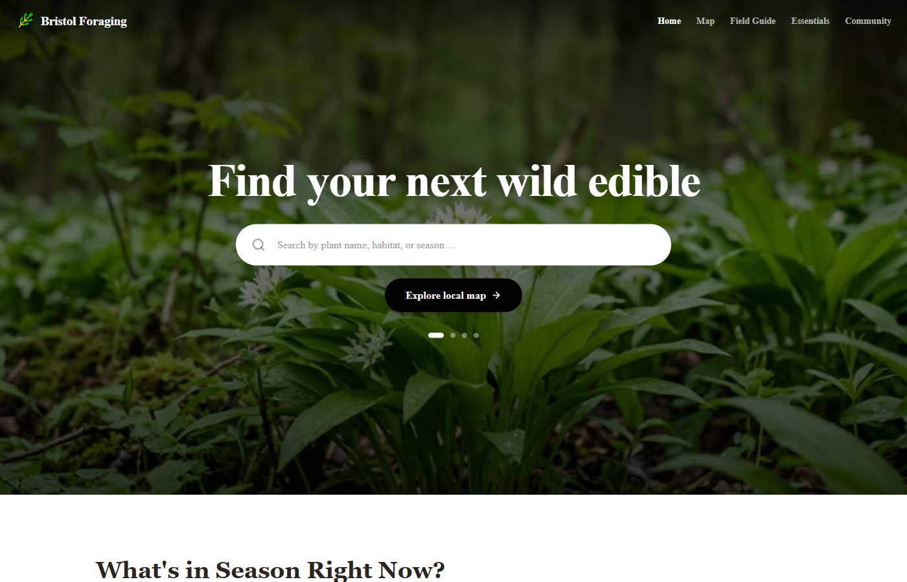

# Bristol Forage

Bristol Forage is a local-first web app for discovering wild edible plants around Bristol.

It combines a seasonal field guide, an interactive location map, safety guidance, and community sightings so beginners can learn what is in season, where plants are likely to appear, and what to double-check before collecting anything.



Live demo: [bristol-forage.vercel.app](https://bristol-forage.vercel.app)

## What It Includes

- Interactive Bristol map with foraging locations and plant availability
- Field guide for wild edible species with seasons, habitat, prep notes, and lookalike warnings
- Seasonal discovery surfaces for what is worth looking for right now
- Essentials guide covering safety, legality, gear, and beginner-friendly plants
- Community sightings and species suggestions stored locally in the browser
- Mobile-friendly Next.js app with static generation for plant guide pages

## Why This Project Exists

Most local nature information is scattered across blogs, books, social posts, and personal knowledge. Bristol Forage turns that into a browsable local product: map first, season aware, and grounded in safe identification habits.

The app is deliberately not a replacement for expert identification. It is a learning and discovery tool that encourages cross-checking, caution, and responsible harvesting.

## Tech Stack

- Next.js 14 App Router
- React
- TypeScript
- Tailwind CSS
- Leaflet and React Leaflet
- Static plant and location datasets
- Browser local storage for community-submitted sightings

## Running Locally

Install dependencies:

```bash
npm install
```

Run the development server:

```bash
npm run dev
```

Open `http://localhost:3000`.

Create a production build:

```bash
npm run build
```

## Project Shape

- `src/app/` - app routes for home, map, field guide, essentials, and community
- `src/components/` - navigation, homepage sections, map UI, and community cards
- `src/data/species.ts` - plant species profiles
- `src/data/locations.ts` - Bristol foraging locations
- `src/lib/` - seasons, local sightings, suggestions, and shared types
- `public/images/` - homepage plant imagery

## Status

Portfolio-ready local discovery app. The live demo is usable, the production build passes, and the repo now has a clear public README. Next polish would be dependency updates, richer map screenshots, and replacing local-storage community data with a small backend if the project becomes more than a demo.
